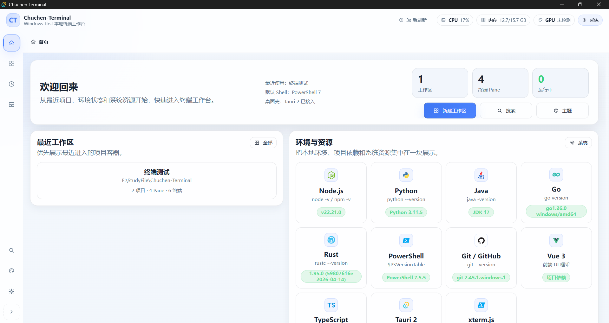
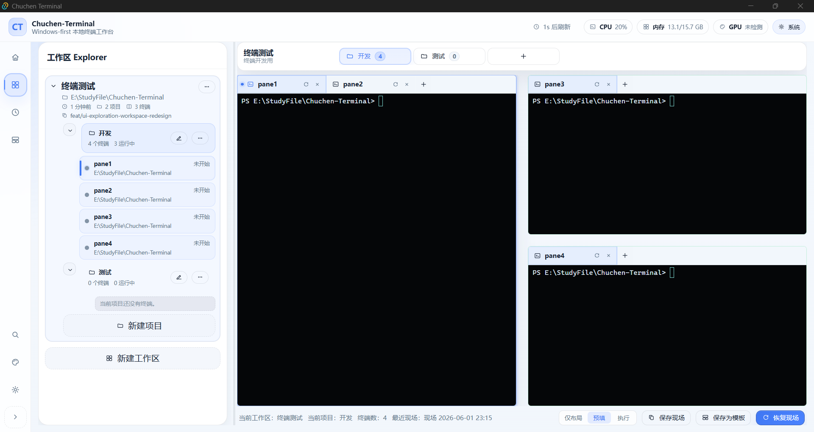
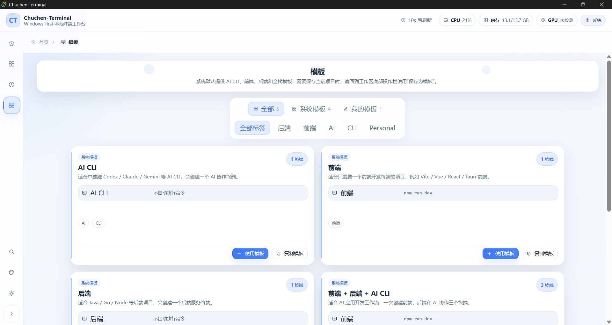
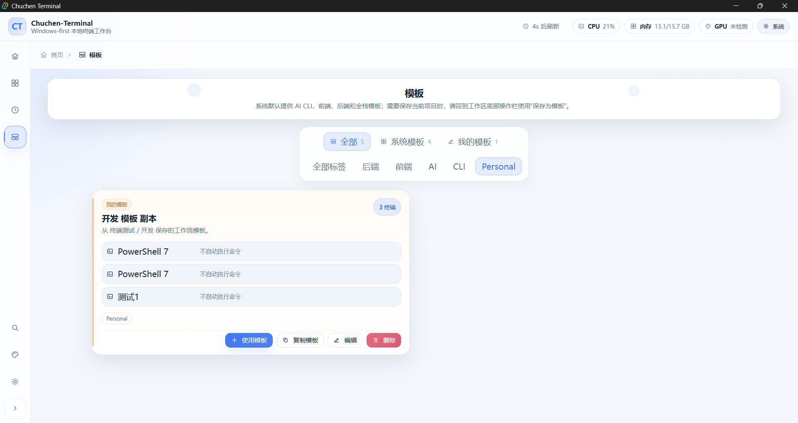
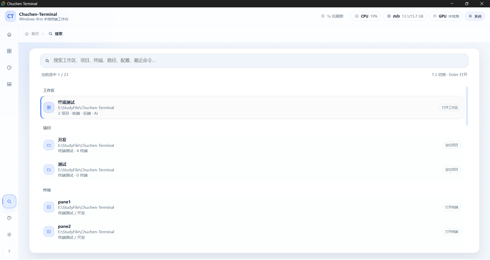
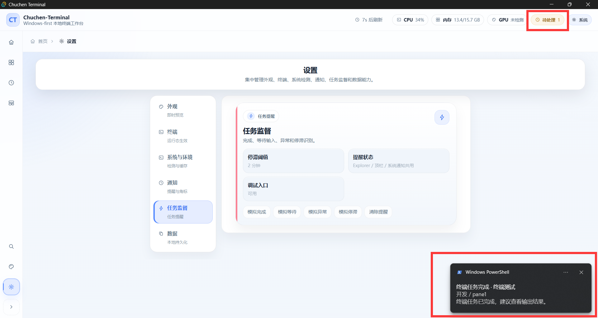
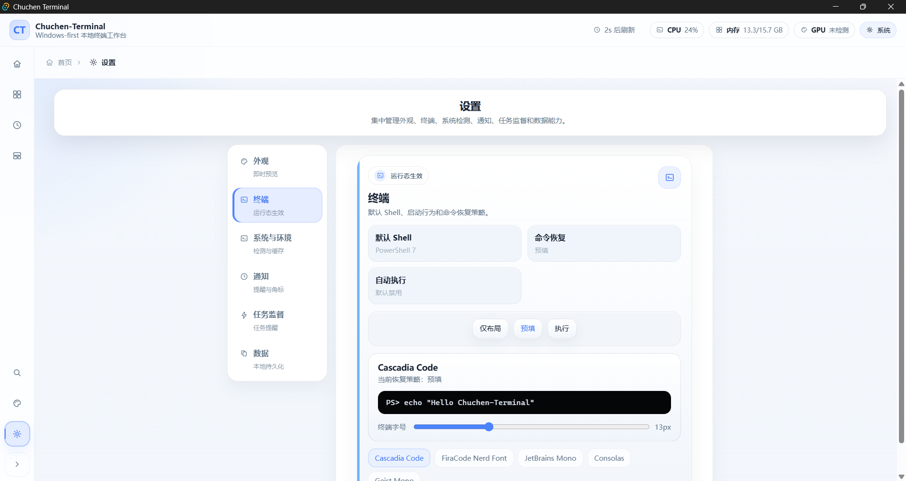

# Chuchen-Terminal

> 面向 AI CLI 时代的本地终端工作台：多工作区、多项目、多 Pane、长任务提醒。

[English](README.md)


Chuchen-Terminal 是一个 Windows 优先的本地桌面终端工作台，基于 Tauri 2、Vue 3、TypeScript、Rust 和 xterm.js 构建。

它不是想再做一个“终端模拟器”，而是想解决 AI 编程工具流行之后，一个越来越明显的问题：

> 终端越来越多，任务越来越长，项目上下文越来越分散，但传统终端仍然只把它们当成一个个 Tab。

Chuchen-Terminal 把终端放回工作流里管理：

```text
工作区 -> 项目 Tab -> Pane -> 终端 Session
```

你可以把它理解成一个面向本地开发和 AI CLI 长任务的 split-pane terminal manager。

## 预览

> 以下截图使用本地演示数据；涉及本机路径或系统通知细节的位置已按需要做脱敏 / 打码处理。

| 首页 / 工作区 | 终端工作台 |
| --- | --- |
|  |  |

| 系统模板 | 个人模板 |
| --- | --- |
|  |  |

| 搜索 | 任务提醒 |
| --- | --- |
|  |  |

| 设置 |
| --- |
|  |
## 它解决什么问题？

如果你经常使用 Codex CLI、Claude Code、Gemini CLI 或其他终端形态的 AI 编程工具，可能会遇到这些情况：

- 同时打开多个项目，前端、后端、脚本、AI CLI 分散在不同终端里。
- AI CLI 跑了几分钟后完成了，但你没有及时看到。
- 某个终端正在等审批、等输入、报错或疑似卡住，但很难从一堆标签里发现。
- 昨天跑过的命令、保存过的布局、项目路径都要重新找。
- 关闭应用后，想恢复之前的分屏现场很麻烦。

Chuchen-Terminal 的目标是把这些状态和关系显式管理起来，而不是继续靠终端标题、命令历史和人工记忆。

## 核心能力

- **工作区层级管理**：工作区、项目 Tab、Pane、终端 Session 形成清晰结构。
- **分屏终端工作台**：支持多个 Pane 同时展示本地终端会话。
- **工作现场保存 / 恢复**：保存项目 Tab、Pane、终端标签与焦点状态。
- **最近记录**：集中查看最近工作区、项目、终端、命令和布局快照。
- **工作流模板**：内置 AI CLI、前端、后端、全栈等常见模板。
- **快速搜索**：搜索工作区、项目、终端、路径、配置、历史命令和布局。
- **任务提醒**：识别完成、等待输入、异常退出、疑似停滞等状态。
- **系统通知 / 任务栏提醒**：用于无人值守的 AI CLI 长任务。
- **Provider 配置管理**：读取、导入、切换并写回 Codex CLI、Claude Code、Gemini CLI 和 Hermes 的完整本机配置。
- **多来源导入与身份归并**：CC Switch 可作为可选导入来源，并对重复 Provider、当前启用状态和稳定身份进行归并。
- **用量与成本统计**：支持按 Provider、模型、渠道和时间范围查看请求明细、Token、缓存、首字延迟、总耗时、官方价格与估算费用。
- **中英双语**：主导航、内置示例、运行时提示、Provider 和 Usage 主路径均已接入中英文切换。
- **浅色 / 暗色主题**：面向日常工作台使用的浅色优先 UI。

2026 年 6 月至 7 月的更新集中完善了 Provider 管理、Usage 统计、本机会话增量读取、多语言、终端性能和界面稳定性。完整变更见 [CHANGELOG.md](CHANGELOG.md)。

## 适合谁？

这个项目更适合：

- 每天会同时打开多个本地仓库的开发者；
- 经常同时运行前端、后端、Worker、脚本和 AI CLI 的开发者；
- 希望管理 Codex CLI、Claude Code、Gemini CLI 等长时间运行任务的人；
- 想把终端按照“工作区 / 项目 / Pane”组织起来的人；
- 想保存和恢复某个项目终端布局的人。

它不太适合：

- 只需要一个极简终端模拟器的人；
- 主要需求是 SSH 连接管理的人；
- 需要云端多人协作终端的人；
- 期待一个已经完全稳定、开箱即用的正式发行版的人。

## 使用场景

### 1. 监督长时间运行的 AI CLI 任务

- **场景**：你让 Codex CLI、Claude Code 或其他 AI CLI 跑几分钟甚至更久，然后切去做别的事情。
- **Chuchen-Terminal 的作用**：把这些会话放在工作区内统一管理，并标记完成、等待输入、异常、疑似停滞等提醒状态。
- **价值**：你不需要一直盯着某一个终端窗口。

对应截图：

- `docs/assets/screenshots/attention.png`

### 2. 把前端、后端、AI 会话放进同一个工作台

- **场景**：一个本地项目往往会同时跑前端开发服务、后端服务、脚本和 AI CLI。
- **Chuchen-Terminal 的作用**：在一个工作区下，用项目 Tab 和 Pane 布局把这些终端组织起来。
- **价值**：终端不再只是匿名标签，而是项目结构的一部分。

对应截图：

- `docs/assets/screenshots/workbench.png`

### 3. 用模板快速复用常见终端组合

- **场景**：你经常重复创建 AI CLI、前端、后端、全栈等终端组合。
- **Chuchen-Terminal 的作用**：系统模板提供常见方案，个人模板沉淀你自己的习惯。
- **价值**：新项目启动更快，也更一致。

对应截图：

- `docs/assets/screenshots/template1.png`
- `docs/assets/screenshots/template2.png`

### 4. 快速搜索本地终端工作台数据

- **场景**：你忘了某个命令在哪个项目跑过，或者忘了某个终端属于哪个工作区。
- **Chuchen-Terminal 的作用**：直接搜索工作区、项目、终端、路径、命令和布局。
- **价值**：减少翻终端历史和手动查找的时间。

对应截图：

- `docs/assets/screenshots/search.png`

### 5. 从更高层的上下文重新进入工作

- **场景**：重新打开应用后，你想先决定从哪个工作区继续，而不是直接掉进某个 shell。
- **Chuchen-Terminal 的作用**：首页先展示工作区层级入口，再进入具体终端工作台。
- **价值**：你是从“上下文”回到工作，而不是从空白终端重新开始。

对应截图：

- `docs/assets/screenshots/home.png`
- `docs/assets/screenshots/settings.png`
## 当前状态

Chuchen-Terminal 目前处于 **MVP / Preview** 阶段。

已经可以用于本地体验和工作流试用，但仍在快速迭代中。UI、数据结构、打包发布、Provider 配置和任务监督能力后续都会继续调整。

如果你也遇到类似问题，欢迎提 Issue。真实使用场景、Bug 反馈、功能建议和截图都很有价值。

## 环境要求

- Windows 10 / Windows 11
- Node.js 20+
- npm 10+
- Rust 1.77+
- WebView2 Runtime

## 安装说明

- `npm install` 只会安装应用壳层所需的 JavaScript / 前端依赖。
- 如果你要运行 **桌面版**（`npm run tauri:dev`）或打包桌面安装包（`npm run tauri:build`），仍然需要完整的 Rust 工具链和 Tauri 构建环境。
- 如果你只是想在浏览器里预览前端界面，那么 `npm install` + `npm run dev` 就够了。
- 如果你要体验桌面端、真实终端运行时、系统通知和任务栏行为，就必须准备完整的桌面开发环境。

换句话说：

- `npm install` ≠ 已经具备桌面运行环境
- `npm run dev` = 只启动前端壳子预览
- `npm run tauri:dev` / `npm run tauri:build` = 仍然需要 Rust + Tauri 构建环境
## 从源码运行

### 方案 A：只看前端预览

如果你只是想在浏览器里看界面、改前端样式，使用这一种即可。

克隆仓库：

```bash
git clone https://github.com/TheYoungChen/Chuchen-Terminal.git
cd Chuchen-Terminal/app
```

安装依赖：

```bash
npm install
```

启动桌面端：

```bash
npm run tauri:dev
```

只启动前端页面：

```bash
npm run dev
```

浏览器访问：

```text
http://127.0.0.1:6173/
```

### 方案 B：运行真实桌面版

如果你要体验真实终端运行时、任务栏行为、系统通知和桌面集成，请使用这一种。

前提条件：

- Node.js 20+
- npm 10+
- Rust 1.77+
- Tauri 构建环境
- WebView2 Runtime

然后执行：

```bash
cd Chuchen-Terminal/app
npm install
npm run tauri:dev
```

即使 `npm install` 成功了，只要 Rust 或 Tauri 构建环境缺失，桌面版仍然无法正常构建或启动。

## 构建

前端构建：

```bash
cd Chuchen-Terminal/app
npm run build
```

桌面端打包：

```bash
cd Chuchen-Terminal/app
npm run tauri:build
```

Tauri / Rust 编译产物会生成在 `app/src-tauri/target/`，这个目录可能非常大，不应该提交到 Git。

## 磁盘占用说明

这个项目的磁盘占用大头通常 **不是源码本身**，而是开发和构建产物。

主要来源包括：

- `app/node_modules/`：`npm install` 安装的前端依赖
- `app/dist/`：前端生产构建产物
- `app/src-tauri/target/`：Rust 和 Tauri 的编译缓存与构建产物

实际体验上：

- `npm install` 会带来常规的 JavaScript 依赖体积；
- 真正容易变得很大的，通常是 `app/src-tauri/target/`；
- 这对本地 Tauri / Rust 开发来说是正常现象，但这些目录都不应该提交到仓库。

如果你只是看 UI、改前端或跑浏览器预览，磁盘占用会明显小于完整桌面构建流程。

## 下载

Windows 预览安装包可以从仓库的 [GitHub Releases](https://github.com/TheYoungChen/Chuchen-Terminal/releases) 页面下载。希望体验最新代码或参与开发时，也可以按照上面的说明从源码运行。
## 演示数据

仓库只保留脱敏后的演示工作区数据。示例路径类似：

```text
D:\Projects\demo-workspace
D:\Projects\demo-frontend
D:\Projects\demo-backend
D:\Projects\demo-agent
```

演示数据用于帮助第一次打开项目时理解界面结构，所有示例均已脱敏，不包含真实工作区路径、项目名、Provider 凭据、API Key、终端日志或私有命令。

## 仓库结构

```text
app/
  src/                 Vue 前端、UI 状态、终端工作台逻辑
  src-tauri/           Tauri 2 Rust 桌面运行时
  scripts/             本地开发辅助脚本
  tests/               桌面端冒烟测试
docs/
  assets/              公开截图和演示素材
README.md
README.zh-CN.md
LICENSE
CONTRIBUTING.md
CODE_OF_CONDUCT.md
SECURITY.md
```

内部计划文档、AI 工具状态、本地缓存、生成产物和个人草稿不属于公开源码分发内容。

## 开发检查

```bash
cd Chuchen-Terminal/app
npm run build
```

涉及终端进程、WebView2、系统通知、任务栏提醒、文件选择器、Windows 路径等行为时，需要在 Windows 桌面环境下验证。

## 路线图

- 补充正式截图和演示 GIF。
- 稳定工作区、模板、搜索和设置流程。
- 完善 Provider 和运行配置管理。
- 增加常见 AI CLI 配置工具的导入 / 导出能力。
- 强化 AI CLI 长任务监督能力。
- 准备签名后的桌面端 Release。

## 反馈、Issue 和 Star

这个项目还在早期阶段，最需要的不是“完美需求”，而是真实使用场景。

如果你愿意反馈，建议包含：

- 你使用的操作系统；
- 你正在使用的 AI CLI 或终端工作流；
- 平时会同时打开多少项目和终端；
- 哪些布局、提醒或交互不符合预期；
- 已经脱敏的截图。

如果 Chuchen-Terminal 解决了你也遇到的问题，欢迎点一个 Star。它能帮助更多有类似需求的人发现这个项目。

## 参与贡献

见 `CONTRIBUTING.md`。

## 安全

见 `SECURITY.md`。

## License

MIT


